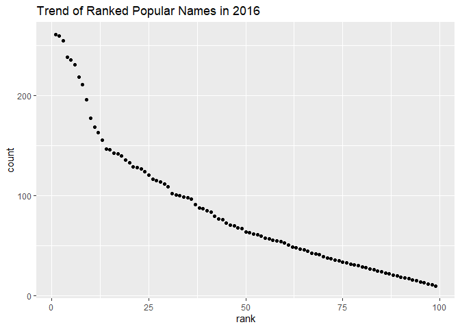

p8105\_hw2\_sz2800
================
Stephanie Zhen
10/04/2019

``` r
library(readxl)
library(tidyverse)
```

    ## -- Attaching packages ----------------------------------------- tidyverse 1.2.1 --

    ## v ggplot2 3.2.1     v purrr   0.3.2
    ## v tibble  2.1.3     v dplyr   0.8.3
    ## v tidyr   1.0.0     v stringr 1.4.0
    ## v readr   1.3.1     v forcats 0.4.0

    ## -- Conflicts -------------------------------------------- tidyverse_conflicts() --
    ## x dplyr::filter() masks stats::filter()
    ## x dplyr::lag()    masks stats::lag()

### Question 1: Trash Wheel

Round the number of sports calls to the nearest integer and converts the
result to an integer variable (using
as.integer)

``` r
dumpster_df = read_excel("./Trash-Wheel-Collection-Totals-8-6-19.xlsx", sheet = "Mr. Trash Wheel", skip =1) %>%
  janitor::clean_names() %>%
  drop_na(dumpster) %>%
  mutate(
    sports_balls = as.integer(sports_balls)
  )
```

    ## New names:
    ## * `` -> ...15
    ## * `` -> ...16
    ## * `` -> ...17

2017 Precipitation import + adding
year

``` r
trash17_df = read_excel("./Trash-Wheel-Collection-Totals-8-6-19.xlsx", sheet =  "2017 Precipitation", skip =1, n_max = 12) %>%
  janitor::clean_names() %>%
    mutate(
      year = 2017)
```

2018 Precipitation import + adding
year

``` r
trash18_df = read_excel("./Trash-Wheel-Collection-Totals-8-6-19.xlsx", sheet =  "2018 Precipitation", skip =1, n_max = 12) %>%
  janitor::clean_names() %>%
    mutate(
      year = 2018)
```

Joining 2017 and 2018 datasets together. Change month name by using
month.name

``` r
prec_join = 
  full_join(trash17_df, trash18_df) %>%
  mutate(
    month = month.name[month]
  )
```

    ## Joining, by = c("month", "total", "year")

In the joined precipitation 2017 and 2018 dataset, there is 24 of
observations with the key variables: month, total, year. There is a
total amount of 70.33 inches of precipitation for over the pass twelve
months of 2018.

In the dataset, dumpster\_df, there is 344 of observations with the key
variables: dumpster, month, year, date, weight\_tons,
volume\_cubic\_yards, plastic\_bottles, polystyrene, cigarette\_butts,
glass\_bottles, grocery\_bags, chip\_bags, sports\_balls,
homes\_powered, x15, x16, x17. In 2017, the median number of sports ball
Mr.Trashwheel was able to retrieve was 8 of sports balls.

### Question 2: fivethirtyeight\_datasets

pols\_month

``` r
pols_clean = read_csv("./fivethirtyeight_datasets/pols-month.csv") %>%
  janitor::clean_names() %>%
  separate(mon, into = c("year", "month", "day"), convert = TRUE)
```

    ## Parsed with column specification:
    ## cols(
    ##   mon = col_date(format = ""),
    ##   prez_gop = col_double(),
    ##   gov_gop = col_double(),
    ##   sen_gop = col_double(),
    ##   rep_gop = col_double(),
    ##   prez_dem = col_double(),
    ##   gov_dem = col_double(),
    ##   sen_dem = col_double(),
    ##   rep_dem = col_double()
    ## )

``` r
pols_clean_tidy = 
  pols_clean %>%
  mutate(month = month.abb[month]) %>%
  mutate(president = ifelse(prez_gop > 0, "gop", "dem")) %>%
  select(-day, -prez_gop, -prez_dem)
```

snp: clean up

``` r
snp_clean = read_csv("./fivethirtyeight_datasets/snp.csv") %>%
  janitor::clean_names() %>%
  separate(date, into = c("month", "day", "year"), convert = TRUE) %>%
  mutate(month = month.abb[month]) %>%
  select(year, month, close)
```

    ## Parsed with column specification:
    ## cols(
    ##   date = col_character(),
    ##   close = col_double()
    ## )

Unemployment\_clean wide to
long

``` r
unemp_clean = read_csv("./fivethirtyeight_datasets/unemployment.csv") %>%
  pivot_longer(
    cols = Jan:Dec,
    names_to = "month",
    values_to = "unemp_perc"
  ) %>%
  select(year = Year, month, unemp_perc) 
```

    ## Parsed with column specification:
    ## cols(
    ##   Year = col_double(),
    ##   Jan = col_double(),
    ##   Feb = col_double(),
    ##   Mar = col_double(),
    ##   Apr = col_double(),
    ##   May = col_double(),
    ##   Jun = col_double(),
    ##   Jul = col_double(),
    ##   Aug = col_double(),
    ##   Sep = col_double(),
    ##   Oct = col_double(),
    ##   Nov = col_double(),
    ##   Dec = col_double()
    ## )

Joining/merging dataset: Left joined pols\_clean\_tidy, snp\_clean then
left join again with resulting dataset and unemp\_clean

``` r
pols_snp_join= 
  left_join(pols_clean_tidy, snp_clean, by = c("year", "month")) 

unemp_p_s_join =
   left_join(pols_snp_join, unemp_clean, by = c("year", "month")) 
```

In the pols\_clean\_tidy dataframe, the key variables present are: year,
month, gov\_gop, sen\_gop, rep\_gop, gov\_dem, sen\_dem, rep\_dem,
president. These columns represent the number of senators, house of
representative and the political party status of the president for a
given year.

In the snp\_clean dataframe, the key variables present are: year, month,
close. This represents the month and year and its respective closing
values of stock index.

In the unemp\_clean dataframe, the key variables present are: year,
month, unemp\_perc. This represent the percentage of unemployment with
its respective year and month.

The resulting joined dataset unemp\_p\_s\_join has the following key
variables:year, month, gov\_gop, sen\_gop, rep\_gop, gov\_dem, sen\_dem,
rep\_dem, president, close, unemp\_perc, with the dimensions: 822, 11.
This dataset spans the time from 1947 to 2015, a total of 68 years.

### Question 3: Popular Baby Names dataset

cleaning baby names dataset

``` r
p_baby_clean = read_csv("./Popular_Baby_Names.csv") %>%
  janitor::clean_names() %>%
  rename("name" = "childs_first_name", "year" = "year_of_birth") %>%
  mutate(ethnicity = recode(ethnicity, "ASIAN AND PACI" = "ASIAN AND PACIFIC ISLANDER", "BLACK NON HISP" = "BLACK NON HISPANIC", "WHITE NON HISP" = "WHITE NON HISPANIC")) %>%
  mutate(name = str_to_upper(name)) %>%
  distinct()
```

    ## Parsed with column specification:
    ## cols(
    ##   `Year of Birth` = col_double(),
    ##   Gender = col_character(),
    ##   Ethnicity = col_character(),
    ##   `Child's First Name` = col_character(),
    ##   Count = col_double(),
    ##   Rank = col_double()
    ## )

Ranks of the name: “OLIVIA” over time.

``` r
olivia_df = p_baby_clean %>%
  filter(name == "OLIVIA", gender == "FEMALE") %>%
  select(name, year, ethnicity, rank) %>%
  pivot_wider(
    names_from = year,
    values_from = rank
  ) %>%
    knitr::kable()
```

Most popular, rank = 1, male birth name over time.

``` r
pop_male_df = p_baby_clean %>%
  filter(rank == 1, gender == "MALE") %>%
  select(name, year, ethnicity) %>%
  pivot_wider(
    names_from = year,
    values_from = name
  ) %>%
    knitr::kable()
```

ggplot:

``` r
male2016_df = p_baby_clean %>%
    filter(gender == "MALE", year == 2016, ethnicity == "WHITE NON HISPANIC")

male2016_plot = ggplot(male2016_df, aes (x = rank, y = count)) +
  geom_point()

print(male2016_plot + ggtitle("Trend of Ranked Popular Names in 2016"))
```

<!-- -->
